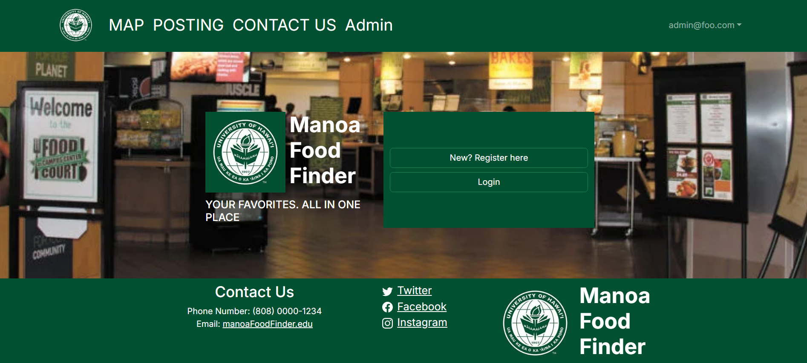

# Project Overview #

As a final project for ICS314 class I developed a web application running with a database named Manoa Food Finder. It was developed as a 4 people group including me, and we work on the GitHub organization to develop Manoa Food Finder 
The main objective of the Manoa Food Finder project is to develop an application that helps students locate food options on the University of Hawaii campus. To achieve the objective, we decided the application should allow vendors to post information about food and for users to quickly check it. 
More Information Here: https://manoa-food-finder.github.io/

### Development Enviroments ###

The environment for the development of the application, we use VS Code to manage the files and codes of the application, and The languages used are TypeScript and HTML/CSS, React-Bootstrap is used as the UI Framework. To construct the database we used next.js template provided in class as a foundation of our application, and postgres server to store our data. First, we created the foundational system such as a landing page for the application on the local server, then, deployed it throughout Vercel. Used all knowledge that we’ve learned in the ICS314 class to develop.

# Structure of the Application #
The overall structure of the is following the next.js template which has a basic data structure for accounts and items with information, so we started at modifying that to make our application. Therefore, the database is controlled through the nextjs into the postgres server.

- **The Role in Account Data:** We added an additional role for the sign-in account which is called vendor, and an account with the role of vendor can add a posting of the food information to a website. To control this, we adjust the accessibility of posting websites depending on the role. For example, if the role of the account is user, that account is only accessible to view the posting of foods, on the other hand, the account with the role of vendor can access to the Add Post Page to add the information of food. The person who wants to use our app and doesn’t have an account can choose their role by the sign up page by selecting the user or vendor in radio choice format. Depending on the choice, the role of the account is stated and stored as a model of USER in the database with an account name and password.
  
- **Posting:** posting is information about food which can be added by the account with the role of vendor and can be viewed by every role of accounts. When AddVendorPostForm is called, it shows the card format submission page, and the page prompt to enter a name, hour, location, and description to the user(not a role). After the user fills all of the content and press submit button at the bottom, our application will take all information and store it into the database with the data structure name VendorPost which contains id, name, hours, location, description, owner which is the account name automatically taken. Then, it will show up on the posting page and be available to see the account regardless of the role.
  
- **Navigation bar and Footer:** Our webpage always shows the navigation bar at the top and footer at the bottom of the page. The navigation bar lists links to the different pages such as posting page and map page, and users can jump to the page by clicking the word. The bar shows, logo which is linked to the landing page, map, posting, and contact us basically. Depending on the role of the account, it shows additional contents to the viewer. For example, vendors can see the vendor info page and it will show up on the navigation bar automatically when viewers logged in as a vendor. Beside that, the footer always shows contact information of our application for user convenience. On any page in our application, the navigation bar and footer shows because we use layout.tsx file to control consistent elements of the page. 

# Expectation and Reality #

At the planning phase, we considered that we have enough time to make a map page to be more functional. Specifically, the map page will be linked with the location of the vendor post by creating the location element in the VendorPost module in schema.prisma, and would be able to jump by clicking the list in the map page. However, we didn’t have enough time to implement those properties for the map page due to taking too much time to solve systematic errors and deploymental errors.

Otherwise, in the expectation, I thought adding a new role is a relatively easier implementation, but in reality the most time taken implementation is this implementation. At first, this implementation is just adding the role for the USER module which we learned how to do in class, so I don't think it will take a long. However, I forgot to consider implementing the radio selection and change the role depending on the viewer's choice at the sign up page, and this implementation is application of what I learned in class then unfamiliar errors occur a lot. As a result, I took a time to fix it than I expected.

# Analyze Problems and Future Challenges #

In this project, one issue that became clear was the importance of schedule management in group projects because our group neglected tasks such as dividing the work according to project efforts after planning, as well as firmly establishing deadlines. The personal cause of this issue was the confusion created by conflicting schedules between the school’s website and the class’s website certainly, however, as a result of the lack of schedule management in our group, it became highly inefficient, with work assignments not being properly distributed. 

I was relatively flexible in supporting everyone and coordinating the overall project such as merging everyone’s branches into one — if an error occured, then fixed it, but I don’t think that was clearly communicated to the team. As a result, I ended up doing many tasks on my own, and I regret not being able to fully take advantage of the benefits of group work.

From these setbacks, I have come to better understand the importance of schedule management in a multi-person setting — for example, clarifying roles and task deadlines. I hope to carry these lessons forward into future projects.
